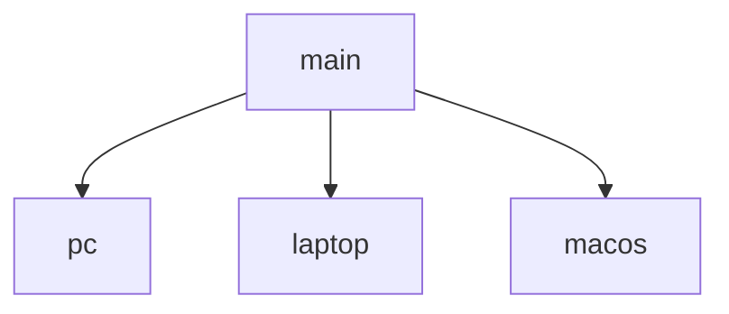

# dotfiles

Shared configuration lives on `main`; each machine has its own branch.



## Configuration

- **Terminal:** [Alacritty](https://alacritty.org/)
- **Shell:** [Fish](https://fishshell.com/)
- **Terminal multiplexer:** [tmux](https://github.com/tmux/tmux)
- **Text editor:** [Neovim](https://neovim.io/)
  - Language support: nvim-treesitter, nvim-lspconfig, blink.cmp, and conform.nvim
  - Navigation: fzf-lua, yazi.nvim, and vim-tmux-navigator
  - Git: gitsigns.nvim, diffview.nvim, vim-fugitive, and git-conflict.nvim
  - UI: rose-pine, lualine.nvim, and which-key.nvim
- **File explorer:** [Yazi](https://yazi-rs.github.io/)
- **Media player:** [mpv](https://mpv.io/)
- **Linux desktop:** [niri](https://github.com/YaLTeR/niri) + [Noctalia](https://github.com/noctalia-dev/noctalia-shell)
- **macOS desktop:** yabai + skhd + SketchyBar
- **Coding agent:** [Pi](https://github.com/earendil-works/pi)

## Setup

Check out the branch for the current machine.

### Linux (`pc` / `laptop`)

Configurations are [GNU Stow](https://www.gnu.org/software/stow/) packages:

```sh
stow alacritty niri nvim tmux fish noctalia mcp yazi mpv
mkdir -p ~/.pi/agent
stow --no-folding pi
```

Rerun `stow -R <package>` to relink a package.

### macOS

```sh
git switch macos
./install-macos.sh
```

Rerun `install-macos.sh` to relink the configuration. Existing files are moved to timestamped backups before linking.

## mpv

Plugins are tracked under `mpv/.config/mpv/scripts/`; shaders live under
`mpv/.config/mpv/shaders/`.

## Host (`pc`)

`valdy-cachy-pc` — CachyOS, Ryzen 5 5500, AMD Navi 22 (RX 6700 XT class,
`amdgpu`). No iGPU, so none of the hybrid render-node handling on `main`
applies. Display is DP-3, an AOC Q27G3XMN at 2560x1440@170Hz, scale 1.

Still tuned for the laptop:

- `alacritty.toml` `font.size = 10` — sized for a 1.75-scale HiDPI panel. This
  monitor is ~109 DPI at scale 1, so 10 renders small; 12-13 is the equivalent.
- `niri/cfg/display.kdl` — output blocks are commented out and autodetect picks
  2560x1440@170 scale 1 correctly, so there is nothing to uncomment unless you
  want VRR (`variable-refresh-rate`) or a fixed mode.
